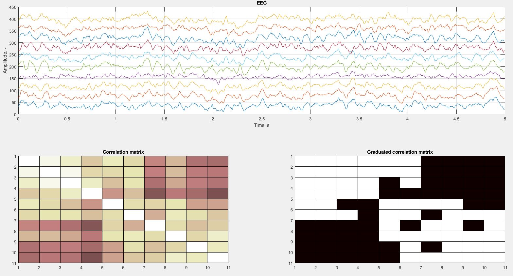
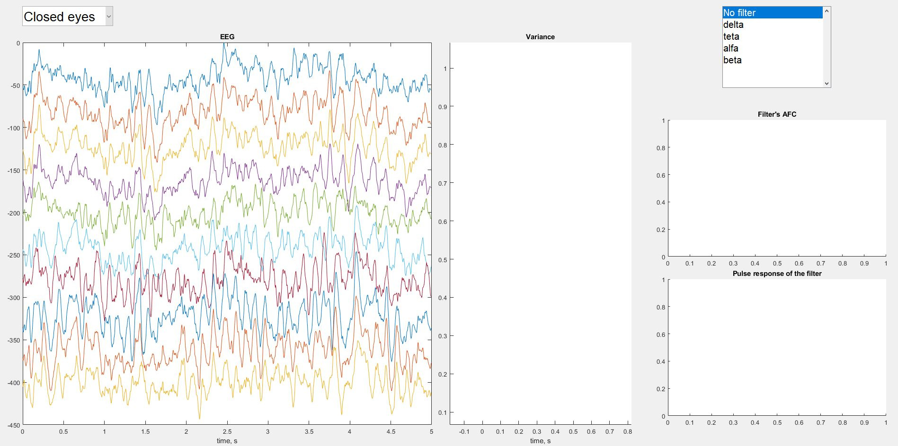
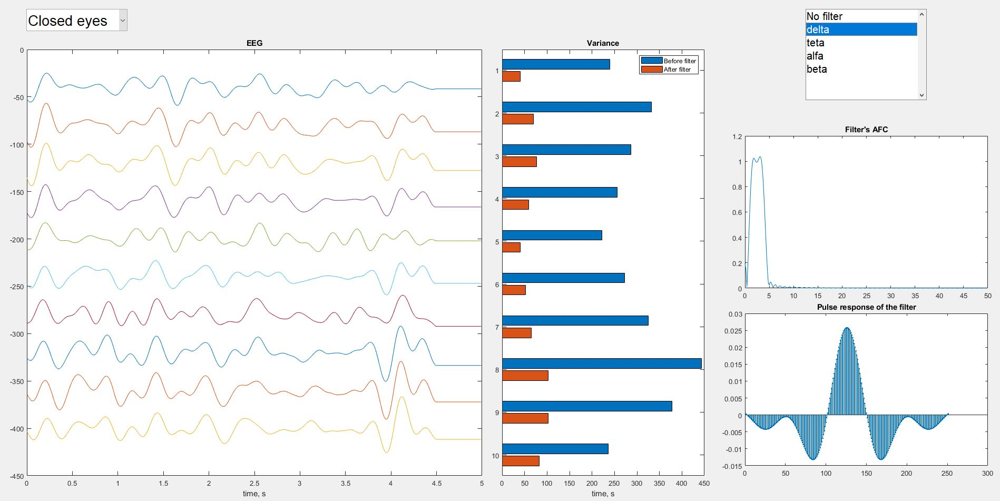
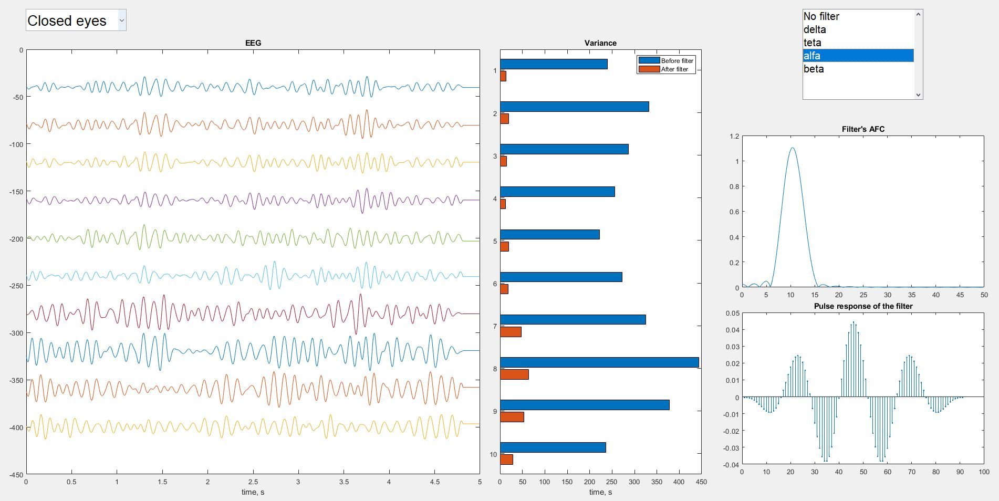

# EEG Processing

## About repository

<b>EEG Processing</b> contains different methods for processing electroencephalogram using MATLAB.

The following processing procedures are presented:

 - [EEG сorrelation analysis](#eeg-сorrelation-analysis) 
 - [Measuring EEG rhythms](#measuring-eeg-rhythms)

## EEG сorrelation analysis

The downloaded electroencephalogram signal samples (sampling rate = 250 Hz) contained 10 chanels.

A correlation matrix illustrating the dependencies between the EEG channels was constructed.

The resulting matrix was transformed into a graded matrix with a given threshold to emphasize statistically significant dependencies.

Results are presented on the picture below:

## Measuring EEG rhythms

EEG signals of patients with eyes closed and eyes open were downloaded to study electroencephalography rhythms (with eyes closed there is a greater alpha rhythm power).

Digital filters are used to examine each rhythm individually, filtering out the desired range of frequencies. The AFC and impulse response of these filters are shown in the figures.

The result of the filtered EEG is shown on the graph. Estimates of the signal dispersion before and after filtering are also displayed.

The pictures below show screenshots of the program:

 

 

 

